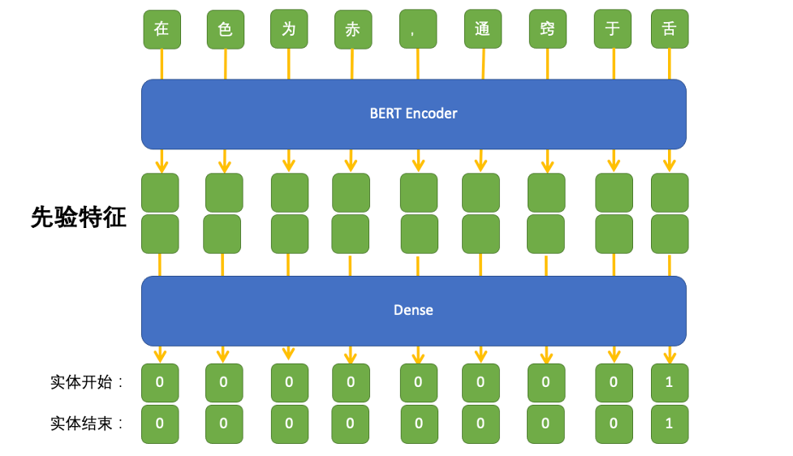

[English Version](README_EN.md)  

# 基于Bert编码器的指针网络中医古籍命名实体标注模型
## 作者信息
姓名：张国庆  
大学：山东中医药大学、2020届微软学生大使  
专业：数据科学于大数据技术专业  
领域：自然语言处理、数字医疗服务  
个人网站：https://dnimo.github.io
## 研究动机
我校文献研究所这些年来，一直潜心整理中医古籍文本，将一批又一批的古籍数据整理为电子文本数据，形成了一个丰富多样的中医语料库。  
如何挖掘隐藏在该语料库中中医学知识，使其高效地服务于高素质中医医师人才的培养的课题，具有非常广阔的研究前景。在项目中，笔者使用自然语言处理技术，使计算机能够自主标注并识别中医古籍命名实体弥补开源社区在这方面的缺憾。从数据库中，我们选取了《朱丹溪-医案评析》、《叶天士-医案评析》、《薛立斋-医案评析》、《谢映庐-医案评析》、《中国现代名中医医案精华》、《金匮方百家医案评议》、《中国百年百名中医临床家丛书》等20本中医古籍进行整理，通过标注，我们形成了以年龄、身体部位、药名、方剂四大实体类别为基础的小规模中医文本数据库。  
### 中医古籍数据化
中医的古籍数据是千百年发展过程中的医疗事件积累，是中医医术传承、创新、发展的重要基石。20世纪以后，信息技术的快速发展、中医古籍的数字化也提上了日程，我校山东中医药大学拥有品类丰富的古籍藏书量，近十年来，我校文献研究院的诸位老师一直潜心于古籍文献的数字化工作。引入数字化可以提升古籍的管理水平，不仅仅是中国，国内外各大藏书机构，都构建了书目数据库，日录中国中医科学院《中医图书联合目录数据库》、日本早稻田大学《图书馆所藏汉籍分类目录·医家类》等，随着古籍“元数据”的近一步规范著录，古籍版本形态得到更详尽的描述，传统目录学在数字化技术的推进下逐渐创新。  
### 数据特点
#### 话题性
在我们进行数据整理与标注的工作过程中，我们观察到中医古籍数据的第一个特点：内容普遍具有话题性。  
  
在上图中记载的一段文字描述了中医学的基础思考模型，这与平时我们所习惯的新闻体比较类似。新闻性问题天然形成一个话题，比如"新冠疫苗最新进展"，用户会围绕这这个话题产生一些相关的搜索行为，比如搜索"肺炎"、"柳叶刀"等潜在的、需要获取的话题意图。在中医古籍中也具有相似的特征，一般情况下，作者都会围绕这某一个病进行长篇幅的讨论，或者搜集治疗此类病的相关诊疗方案，并附上自己的评论。  
  
关于这张图我们想要谈论的，在中医古籍数据中比较特殊的话题性。因为在古籍记录中关于病人身体症状表现的表述会非常多，中医中的术语也和我们日常学习的病理学有较大差异。原因在于翻译的不准确，我们将病理学中的术语没有很好地对应到中医的术语体系中，所以造成西方传入的病理学汉化术语，在中医体系中有相同的文字表述，但却代表着完全不同的意义。例如病理学中的“病症”和中医体系中的“病”、“症”完全不同。中医的病并不复杂，中医判定疾病的标准是证候中最突出的症状或者体征，这一症状或体征下的开始到转归的过程叫做病。所以中医的病和西医的病是截然不同的，以疟疾举例，在中医的思考模型下，只要出现寒热交替，有无规律的往来便可以称之为疟疾。中医在讨论病时，常常会抛出他们认为关键，但又让他们困扰、值得讨论的证，如在疟疾病下又出现多种不同的证型分别是，正疟、温疟、寒疟、瘴疟（瘴虐又分冷瘴，热瘴）、劳疟、疟母。以上都叫疟疾，但其病机又是大相径庭。所以当一群医生发起讨论时，某些“证”的词也会自然形成一个话题，也就是是揭示病。故，我们认为中医古籍的内容普遍存在话题性。  
### 基于BERT模型的编码器
我们使用MIT开源的序列标注模型doccano进行实体标注，由于人手和时间原因，最终有效的标注样本共计10000条。我们将其中的7000条作为训练数据，进行模型的训练，剩下的3000条数据集用于评估模型的性能。我将BERT模型作为编码器使用，用于学习语料库中的语法特征。
### 基于指针网络的"半指针-半标注"的输出设计
如果我们使用了一个最简单的方案即输出一个0/1序列：直接标注出材料中的每个词“是（1）”或“否（0）”的答案。但是这样的效果并不好，因为一个答案可能由连续多个不同的词组成，要让模型将这些不同的词都有同样的标注结果，对模型的设计要求过高，所以笔者最终选择使用两次标注的方法，分别标注实体的开始位置和终止位置。同时，为了处理一个词可能在不同的语境下对应多个不同的标签，在预测实体标签时，我们将常用的softmax函数变更为sigmoid函数，这样就允许了多个实体对应多个关系的情况。最终模型输出的是两列浮点数，分别代表了实体起始位置和终止位置的打分。  
## 总体结构

## 关于数据获取
本数据集是公开的，想要获取本项目所使用的数据集，请通过扫描下放微信公众号二维码，或访问作者网站查看联系方式。
## 免责声明
报告中所呈现的实验结果仅表明在特定数据集和超参组合下的表现，并不能代表各个模型的本质。 实验结果可能因随机数种子，计算设备而发生改变。 该项目中的内容仅供技术研究参考，不作为任何结论性依据。使用者可以在许可证范围内任意使用该模型，但我们不对因使用该项目内容造成的直接或间接损失负责。
# 联系我们
